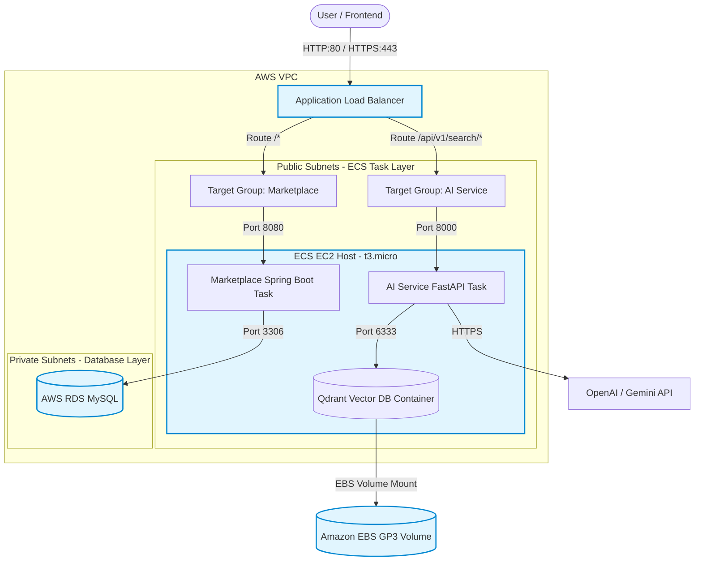

# Vendora AWS Deployment Design

This document details the cost-optimized, secure, and production-ready AWS deployment architecture for the **Vendora B2B E-Commerce Marketplace System**. It is designed to maximize learning value while strictly adhering to the AWS Free Tier limitations.

---

## 1. System Overview & Constraints

The deployment hosts two backend microservices:
1.  **Marketplace Service (Spring Boot):** Core B2B transaction processing engine. Connects to MySQL.
2.  **AI Service (FastAPI):** Product recommendation and semantic search/chatbot service. Connects to Qdrant.

### Cost & Security Constraints:
*   **100% Free Tier Compliant (Under normal usage):** Uses EC2, RDS, and ECR free tiers. Avoids Fargate (which has no free tier) and NAT Gateways (~$32/month).
*   **Security Groups as Network Firewalls:** Tasks are placed in public subnets (to bypass NAT Gateway costs) but locked down via Security Groups to only allow incoming traffic from the Application Load Balancer (ALB).
*   **Ephemeral Compute, Persistent Data:** Compute resources can be turned off or destroyed completely without losing database data.

---

## 2. Architecture Diagram



---

## 3. Network & Security Architecture

To keep the environment free while maintaining high security, we use **VPC Security Groups** instead of private subnets + NAT Gateways.

### Subnet Layout
*   **Public Subnets (x2, Multi-AZ):** Hosts the Application Load Balancer (required by AWS) and the single ECS EC2 instance.
*   **Private Subnets (x2, Multi-AZ):** Hosts the Amazon RDS database, completely isolating it from the public internet.

### Internal Microservice Communication
*   **Routing Path:** The Marketplace Service (Spring Boot) communicates with the AI Service (FastAPI) by routing requests out to the ALB's public/private DNS name (e.g., `http://<ALB-DNS-Name>`).
*   **Configuration:** The environment variable `AI_SERVICE_URL` in the Spring Boot task definition is set to the ALB's DNS URL. Traffic is routed dynamically through the ALB's listener rules down to the AI target group.

### Security Groups Policy

| Security Group | Ingress (Incoming Traffic) | Egress (Outgoing Traffic) | Notes |
| :--- | :--- | :--- | :--- |
| **ALB-SG** | Port 80 & 443 from `0.0.0.0/0` | Port 8080 & 8000 to **ECS-SG** | Public entry point. |
| **ECS-SG** | Port 8080 & 8000 from **ALB-SG**<br>Port 22 from Administrator IP (SSH) | Anywhere (`0.0.0.0/0`) | Blocked from direct public access. Can make external API calls (e.g. OpenAI/ECR). |
| **RDS-SG** | Port 3306 from **ECS-SG** | None | Private database. Cannot be reached from the internet. |

---

## 4. Component Details

### A. Application Load Balancer (ALB)
*   Routes incoming API requests dynamically to ECS target groups:
    *   Path `/api/v1/search/*`, `/api/v1/recommendations/*`, or `/api/v1/chat/*` $\rightarrow$ **AI-Service-TG**
    *   Path `/*` (default) $\rightarrow$ **Marketplace-Service-TG**

### B. Compute: ECS on EC2 (`t3.micro` / `t2.micro`)
*   **EC2 Cluster Hosting:** Instead of AWS Fargate, we register a single Free Tier EC2 instance as a container host in our ECS cluster to stay under the 750 free hour/month limit.
*   **Network Mode (`awsvpc`):** Every task runs in `awsvpc` network mode, meaning each task gets its own Elastic Network Interface (ENI) and private IP in the subnet.
*   **Dynamic ALB Registration:** AWS ECS coordinates automatically with the ALB. When a task starts, ECS auto-registers the task's IP and container port to the Target Group (type: `IP`). When a task is stopped or updated, ECS automatically drains traffic and de-registers it.
*   **Capacity Provider Auto-Scaling:** If tasks enter a `PENDING` state due to host CPU/Memory constraints, an **ECS Capacity Provider** automatically triggers the underlying EC2 **Auto Scaling Group (ASG)** to spin up a new EC2 instance, register it to the cluster, and launch the pending tasks.

### C. Relational Database: Amazon RDS MySQL
*   **Instance Class:** `db.t3.micro` (Single-AZ).
*   **Storage:** 20 GB GP3.
*   **Credentials:** Injected dynamically into Spring Boot from AWS Systems Manager Parameter Store.

### D. Vector Database: Qdrant
*   **Deployment:** Run as a self-hosted Docker container alongside the FastAPI service on the same ECS EC2 host.
*   **Persistence:** Uses an **EBS GP3 Volume** formatted as `ext4` and mounted to the host filesystem. This directory is then mounted as a Docker volume (`/qdrant/storage`) inside the Qdrant container.

---

## 5. Deployment & Automation (CI/CD)

We use **GitHub Actions** for CI/CD. The deployment is triggered on pushes to the `main` branch.

### Deployment Workflow:
1.  Build Spring Boot JAR and FastAPI Python binaries.
2.  Log in to **Amazon ECR** (Elastic Container Registry).
3.  Build, tag, and push Docker images for both services to ECR.
4.  Render updated ECS Task Definitions containing the new ECR image tags.
5.  Deploy the new Task Definitions to the ECS Services.

---

## 6. Infrastructure as Code (Terraform)

To support spinning the stack up/down easily, the Terraform configurations are split into two directories:

### 1. `terraform/stateful/`
*   **Resources:** VPC, Subnets, DB Subnet Groups, RDS Instance, and EBS Volumes.
*   **Usage:** Deployed once. Kept active (but stopped when not in use) to preserve your database data.
*   **Protection:** `skip_final_snapshot = false` configured on RDS to take a snapshot before any accidental deletion.

### 2. `terraform/stateless/`
*   **Resources:** Application Load Balancer, Target Groups, ECS Cluster, ECS Service Definitions, and Security Groups.
*   **Usage:** Can be safely destroyed (`terraform destroy`) and rebuilt (`terraform apply`) at any time without losing database contents.

---

## 7. Operational Runbook: Pausing & Resuming

When you are not actively developing or testing, turn off resources to avoid charges.

### To Pause the Stack:
1.  Set ECS service desired tasks to `0` for both services.
    ```bash
    aws ecs update-service --cluster vendora-cluster --service marketplace-service --desired-count 0
    aws ecs update-service --cluster vendora-cluster --service ai-service --desired-count 0
    ```
2.  Stop the ECS EC2 Host Instance.
3.  Stop the RDS MySQL Database Instance.
    *   *Note: RDS will auto-start after 7 days. If pausing longer, terminate the instance after ensuring a snapshot is created.*

### To Resume the Stack:
1.  Start the RDS MySQL Database Instance.
2.  Start the ECS EC2 Host Instance.
3.  Set ECS service desired tasks to `1`.
    ```bash
    aws ecs update-service --cluster vendora-cluster --service marketplace-service --desired-count 1
    aws ecs update-service --cluster vendora-cluster --service ai-service --desired-count 1
    ```
