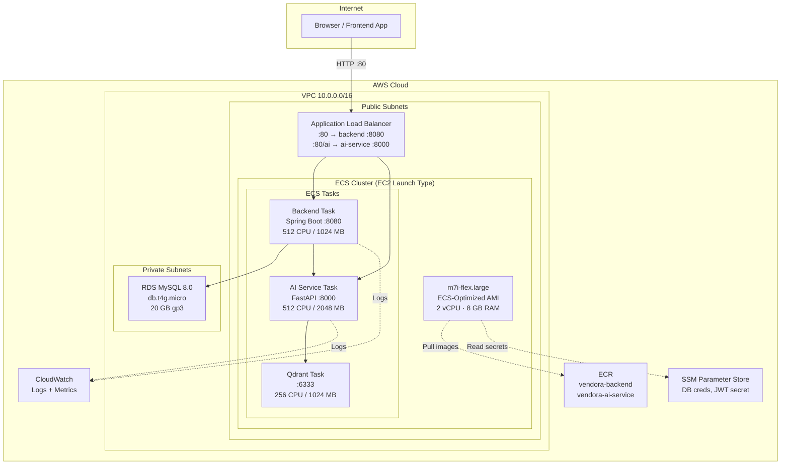

# Deploy Vendora E-Commerce Backend to AWS — Revised Plan

## Background & Decisions

Based on your feedback, here is the finalized architecture:

| Decision | Choice | Rationale |
|---|---|---|
| Compute | **ECS (EC2 launch type)** | Free Plan eligible, no Fargate |
| EC2 Instance | **m7i-flex.large** (2 vCPU, 8 GB RAM) | Free Plan eligible, plenty of RAM for all services |
| Database | **RDS MySQL** (`db.t3.micro` or `db.t4g.micro`) | Free Plan credits cover it |
| Container Registry | **ECR** | 500 MB free private storage |
| Load Balancer | **ALB** | Covered by Free Plan credits, no Route 53 needed |
| Monitoring | **CloudWatch** | Skip Prometheus/Grafana/Loki stack |
| Secrets | **SSM Parameter Store** | Free (vs Secrets Manager which costs $0.40/secret/mo) |
| Deployment | **Manual `terraform apply`** | Full control, easy `terraform destroy` to stop billing |
| DNS | **ALB DNS name directly** | No custom domain, no Route 53 |

### AWS Free Plan Budget Estimate

Your account is on the **new AWS Free Plan** ($200 credits, 6-month window).

| Service | Estimated Cost | Notes |
|---|---|---|
| EC2 m7i-flex.large | ~$0.10/hr = ~$72/mo if 24/7 | Covered by credits; destroy when not testing |
| RDS db.t4g.micro | ~$0.016/hr = ~$12/mo | Covered by credits |
| ALB | ~$0.023/hr + LCU = ~$17/mo | Covered by credits |
| ECR | Free (< 500 MB) | — |
| ECS | Free (control plane) | No charge for ECS itself |
| SSM Parameter Store | Free (Standard tier) | — |
| CloudWatch | Free (basic monitoring) | — |
| NAT Gateway | **$0 — we won't use one** | All in public subnets |
| **Total if running 24/7** | **~$100/mo** | Destroy infrastructure when not testing! |

> [!TIP]
> Running `terraform destroy` when you're done testing brings the cost to near **$0**. If you test for a few hours at a time, you'll spend only a few dollars from your $200 credit pool.

---

## Architecture



### Key Architecture Decisions

1. **No NAT Gateway** — Saves ~$32/mo. The EC2 instance lives in a public subnet with a public IP so it can pull ECR images and reach the internet directly. RDS is in private subnets (accessible only from the ECS security group).

2. **ECS Service Connect (awsvpc)** — All tasks use `awsvpc` network mode, where each task gets its own Elastic Network Interface (ENI) with a private IP. Services discover each other via **ECS Service Connect** backed by **AWS Cloud Map**. A private DNS namespace `vendora.local` is created, and each service registers under it:
   - Backend → `backend.vendora.local:8080`
   - AI Service → `ai-service.vendora.local:8000`
   - Qdrant → `qdrant.vendora.local:6333`

   This is more production-realistic than bridge mode and allows independent scaling of services in the future.

3. **ALB Path-Based Routing** — The ALB routes:
   - `/api/*` → Backend target group (port 8080)
   - `/swagger-ui/*`, `/v3/api-docs/*` → Backend target group (port 8080)
   - `/ai/*` → AI Service target group (port 8000) *(optional, if frontend calls AI directly)*
   - Default → Backend

4. **Qdrant as ECS Task** — Runs as an ECS service with an EBS-backed Docker volume for persistence. The AI service connects to it via `qdrant.vendora.local:6333` (Service Connect DNS).

---

## Terraform Module Structure

```
terraform/
├── main.tf                     # Root module — wires all modules together
├── variables.tf                # Input variables (region, instance type, DB password, etc.)
├── outputs.tf                  # ALB DNS, RDS endpoint, ECR URLs
├── terraform.tfvars            # Your values (gitignored!)
├── versions.tf                 # Required providers & Terraform version
├── .gitignore                  # Ignore .terraform/, *.tfstate, terraform.tfvars
├── push-images.sh              # Script to build & push Docker images to ECR
│
├── modules/
│   ├── networking/             # VPC, subnets, IGW, route tables, security groups
│   │   ├── main.tf
│   │   ├── variables.tf
│   │   └── outputs.tf
│   │
│   ├── ecr/                    # ECR repositories for backend + AI service
│   │   ├── main.tf
│   │   ├── variables.tf
│   │   └── outputs.tf
│   │
│   ├── database/               # RDS MySQL instance + subnet group
│   │   ├── main.tf
│   │   ├── variables.tf
│   │   └── outputs.tf
│   │
│   ├── secrets/                # SSM Parameter Store entries
│   │   ├── main.tf
│   │   ├── variables.tf
│   │   └── outputs.tf
│   │
│   ├── ecs/                    # ECS cluster, Cloud Map namespace, Service Connect,
│   │   ├── main.tf             #   EC2 capacity, task defs, services
│   │   ├── variables.tf
│   │   ├── outputs.tf
│   │   └── user_data.sh        # Bootstrap script for ECS agent config
│   │
│   └── alb/                    # ALB, target groups, listeners, health checks
│       ├── main.tf
│       ├── variables.tf
│       └── outputs.tf
│
└── docker-compose.prod.yml     # Reference only — not used in ECS, kept for local testing
```

---

## Proposed Changes — Phase by Phase

### Phase 1: Project Setup & Networking

#### [NEW] `terraform/versions.tf`
```hcl
terraform {
  required_version = ">= 1.5"
  required_providers {
    aws = {
      source  = "hashicorp/aws"
      version = "~> 5.0"
    }
  }
}
```

#### [NEW] `terraform/.gitignore`
- `.terraform/`, `*.tfstate`, `*.tfstate.backup`, `terraform.tfvars`, `.terraform.lock.hcl`

#### [NEW] `terraform/modules/networking/main.tf`

| Resource | Details |
|---|---|
| `aws_vpc` | CIDR `10.0.0.0/16`, enable DNS hostnames |
| `aws_subnet` (public × 2) | `10.0.1.0/24`, `10.0.2.0/24` in 2 AZs — for ALB + ECS EC2 |
| `aws_subnet` (private × 2) | `10.0.10.0/24`, `10.0.11.0/24` in 2 AZs — for RDS |
| `aws_internet_gateway` | Attached to VPC |
| `aws_route_table` (public) | Default route `0.0.0.0/0` → IGW |
| `aws_route_table_association` | Associate public subnets |
| **No NAT Gateway** | Private subnets have no internet access (RDS doesn't need it) |
| `aws_security_group` "alb" | Inbound: 80 from `0.0.0.0/0`. Outbound: all |
| `aws_security_group` "ecs" | Inbound: 8080, 8000, 6333, 6334 from ALB SG + **self** (for awsvpc inter-task communication). Outbound: all |
| `aws_security_group` "rds" | Inbound: 3306 from ECS SG only. Outbound: none |

---

### Phase 2: ECR Repositories

#### [NEW] `terraform/modules/ecr/main.tf`

| Resource | Details |
|---|---|
| `aws_ecr_repository` "backend" | Name: `vendora-backend`, image tag mutability: MUTABLE, scan on push: true |
| `aws_ecr_repository` "ai_service" | Name: `vendora-ai-service`, same settings |
| `aws_ecr_lifecycle_policy` | Keep only last 5 images (save storage within 500 MB free limit) |

**Outputs**: repository URLs for both images.

After `terraform apply`, push images using the provided script:
```bash
# From the terraform/ directory
chmod +x push-images.sh
./push-images.sh
```

#### [NEW] `terraform/push-images.sh`

A convenience script that authenticates to ECR, builds both images for the correct platform, tags, and pushes them:

```bash
#!/usr/bin/env bash
set -euo pipefail

# ── Configuration ─────────────────────────────────────────────
REGION=$(terraform output -raw aws_region 2>/dev/null || echo "us-east-1")
ACCOUNT_ID=$(aws sts get-caller-identity --query Account --output text)
ECR_URL="${ACCOUNT_ID}.dkr.ecr.${REGION}.amazonaws.com"
PROJECT_ROOT="$(cd "$(dirname "$0")/.." && pwd)"   # parent of terraform/
PLATFORM="linux/amd64"  # m7i-flex.large is x86_64

echo "══════════════════════════════════════════════"
echo "  ECR Push — Region: ${REGION}"
echo "  Account: ${ACCOUNT_ID}"
echo "  Platform: ${PLATFORM}"
echo "══════════════════════════════════════════════"

# ── Step 1: Authenticate Docker to ECR ────────────────────────
echo "\n🔑 Authenticating Docker to ECR..."
aws ecr get-login-password --region "${REGION}" \
  | docker login --username AWS --password-stdin "${ECR_URL}"

# ── Step 2: Build & push backend ──────────────────────────────
BACKEND_IMAGE="${ECR_URL}/vendora-backend:latest"
echo "\n🏗️  Building backend image (${PLATFORM})..."
docker buildx build --platform "${PLATFORM}" \
  -t "${BACKEND_IMAGE}" \
  --push \
  "${PROJECT_ROOT}"
echo "✅ Backend pushed: ${BACKEND_IMAGE}"

# ── Step 3: Build & push AI service ───────────────────────────
AI_IMAGE="${ECR_URL}/vendora-ai-service:latest"
echo "\n🏗️  Building AI service image (${PLATFORM})..."
docker buildx build --platform "${PLATFORM}" \
  -t "${AI_IMAGE}" \
  --push \
  "${PROJECT_ROOT}/ai-service"
echo "✅ AI service pushed: ${AI_IMAGE}"

echo "\n🎉 All images pushed successfully!"
```

> [!IMPORTANT]
> Your current Dockerfiles build for `linux/arm64`. The **m7i-flex.large** is an **x86_64 (Intel)** instance. The script builds with `--platform linux/amd64` automatically to handle this.

---

### Phase 3: Database (RDS)

#### [NEW] `terraform/modules/database/main.tf`

| Resource | Details |
|---|---|
| `aws_db_subnet_group` | Uses the 2 private subnets |
| `aws_db_instance` | Engine: `mysql 8.0`, instance: `db.t4g.micro`, storage: 20 GB gp3, single-AZ |
| | DB name: `vendora_db`, username: `vendora_app`, password: from variable |
| | `publicly_accessible = false`, skip final snapshot, backup retention: 0 days |
| | Security group: `rds-sg` |
| | Parameter group: default MySQL 8.0 |

**Outputs**: RDS endpoint, port, database name.

> [!NOTE]
> Flyway migrations will run automatically when the Spring Boot backend starts and connects to this RDS instance. No manual SQL setup needed.

---

### Phase 4: Secrets (SSM Parameter Store)

#### [NEW] `terraform/modules/secrets/main.tf`

| Parameter | Type | Value |
|---|---|---|
| `/vendora/db/url` | String | `jdbc:mysql://<rds_endpoint>:3306/vendora_db` |
| `/vendora/db/username` | String | `vendora_app` |
| `/vendora/db/password` | SecureString | From `var.db_password` |
| `/vendora/jwt/secret` | SecureString | From `var.jwt_secret` |
| `/vendora/ai/service-url` | String | `http://ai-service.vendora.local:8000` (Service Connect DNS) |
| `/vendora/ai/qdrant-host` | String | `qdrant.vendora.local` (Service Connect DNS) |

The ECS task definitions will inject these as environment variables at container startup.

---

### Phase 5: ECS Cluster + Compute

This is the most complex module. Here's what it contains:

#### [NEW] `terraform/modules/ecs/main.tf`

**5a. ECS Cluster + Service Connect Namespace**

| Resource | Details |
|---|---|
| `aws_ecs_cluster` | Name: `vendora-cluster` |
| `aws_service_discovery_private_dns_namespace` | Name: `vendora.local`, VPC-bound. This is the Cloud Map namespace for Service Connect |
| `aws_ecs_cluster` → `service_connect_defaults` | Set default namespace to `vendora.local` ARN |

**5b. EC2 Launch Template + Auto Scaling Group**

| Resource | Details |
|---|---|
| `data.aws_ssm_parameter` "ecs_ami" | Fetches latest ECS-optimized Amazon Linux 2023 AMI |
| `aws_launch_template` | AMI: ECS-optimized, instance type: `m7i-flex.large` |
| | IAM instance profile, public subnet, ECS SG |
| | User data: writes `ECS_CLUSTER=vendora-cluster` to `/etc/ecs/ecs.config` |
| `aws_autoscaling_group` | Min: 1, Max: 1, Desired: 1 (single instance) |
| | Tags: `AmazonECSManaged = true` |
| `aws_ecs_capacity_provider` | Links ASG to ECS for managed scaling |

**5c. IAM Roles**

| Role | Policies |
|---|---|
| EC2 Instance Role | `AmazonEC2ContainerServiceforEC2Role`, `AmazonSSMReadOnlyAccess`, `CloudWatchLogsFullAccess`, `AmazonEC2ContainerRegistryReadOnly` |
| ECS Task Execution Role | `AmazonECSTaskExecutionRolePolicy`, SSM `GetParameters` for `/vendora/*` |
| ECS Task Role | `CloudWatchLogsFullAccess` (for application logs) |

**5d. ECS Task Definitions**

Three separate task definitions, all using **awsvpc** network mode (each task gets its own ENI):

##### Backend Task Definition
```json
{
  "family": "vendora-backend",
  "networkMode": "awsvpc",
  "containerDefinitions": [{
    "name": "backend",
    "image": "<ecr_url>/vendora-backend:latest",
    "cpu": 512,
    "memory": 1024,
    "portMappings": [{
      "containerPort": 8080,
      "name": "backend",
      "appProtocol": "http"
    }],
    "environment": [
      {"name": "DATABASE_URL", "value": "jdbc:mysql://<rds_endpoint>:3306/vendora_db"},
      {"name": "AI_SERVICE_URL", "value": "http://ai-service.vendora.local:8000"},
      {"name": "SPRING_PROFILES_ACTIVE", "value": "prod"}
    ],
    "secrets": [
      {"name": "DATABASE_USERNAME", "valueFrom": "/vendora/db/username"},
      {"name": "DATABASE_PASSWORD", "valueFrom": "/vendora/db/password"},
      {"name": "JWT_SECRET", "valueFrom": "/vendora/jwt/secret"}
    ],
    "logConfiguration": {
      "logDriver": "awslogs",
      "options": {
        "awslogs-group": "/ecs/vendora-backend",
        "awslogs-region": "<region>",
        "awslogs-stream-prefix": "backend"
      }
    },
    "healthCheck": {
      "command": ["CMD-SHELL", "curl -f http://localhost:8081/actuator/health || exit 1"],
      "interval": 30,
      "timeout": 5,
      "retries": 3,
      "startPeriod": 60
    }
  }]
}
```

##### AI Service Task Definition
```json
{
  "family": "vendora-ai-service",
  "networkMode": "awsvpc",
  "containerDefinitions": [{
    "name": "ai-service",
    "image": "<ecr_url>/vendora-ai-service:latest",
    "cpu": 512,
    "memory": 2048,
    "portMappings": [{
      "containerPort": 8000,
      "name": "ai-service",
      "appProtocol": "http"
    }],
    "environment": [
      {"name": "QDRANT_HOST", "value": "qdrant.vendora.local"},
      {"name": "QDRANT_PORT", "value": "6333"},
      {"name": "SPRING_BOOT_URL", "value": "http://backend.vendora.local:8080"}
    ],
    "logConfiguration": {
      "logDriver": "awslogs",
      "options": {
        "awslogs-group": "/ecs/vendora-ai-service",
        "awslogs-region": "<region>",
        "awslogs-stream-prefix": "ai-service"
      }
    }
  }]
}
```

##### Qdrant Task Definition
```json
{
  "family": "vendora-qdrant",
  "networkMode": "awsvpc",
  "containerDefinitions": [{
    "name": "qdrant",
    "image": "qdrant/qdrant:latest",
    "cpu": 256,
    "memory": 1024,
    "portMappings": [
      {
        "containerPort": 6333,
        "name": "qdrant",
        "appProtocol": "http"
      },
      {
        "containerPort": 6334,
        "name": "qdrant-grpc",
        "appProtocol": "grpc"
      }
    ],
    "mountPoints": [{
      "sourceVolume": "qdrant-storage",
      "containerPath": "/qdrant/storage"
    }]
  }],
  "volumes": [{
    "name": "qdrant-storage",
    "dockerVolumeConfiguration": {
      "scope": "shared",
      "driver": "local"
    }
  }]
}
```

> [!NOTE]
> With `awsvpc` network mode, each task gets its own ENI. The `m7i-flex.large` supports a maximum number of ENIs (typically 3 for `.large` instances). With 3 tasks, this fits exactly. If you add more services, consider increasing instance size.

**5e. ECS Services (with Service Connect)**

Each ECS service is configured with Service Connect to register into the `vendora.local` namespace:

| Service | Task Definition | Desired Count | Service Connect Port Name | Discovery Name | Load Balancer |
|---|---|---|---|---|---|
| `vendora-backend-svc` | vendora-backend | 1 | `backend` | `backend.vendora.local` | ALB target group (port 8080) |
| `vendora-ai-svc` | vendora-ai-service | 1 | `ai-service` | `ai-service.vendora.local` | None (internal) |
| `vendora-qdrant-svc` | vendora-qdrant | 1 | `qdrant` | `qdrant.vendora.local` | None (internal) |

Service Connect configuration on each service (Terraform `service_connect_configuration` block):
```hcl
service_connect_configuration {
  enabled   = true
  namespace = aws_service_discovery_private_dns_namespace.vendora.arn

  service {
    port_name      = "backend"          # matches portMappings.name in task def
    discovery_name = "backend"          # registers as backend.vendora.local
    client_alias {
      port     = 8080
      dns_name = "backend.vendora.local"
    }
  }
}
```

**5f. CloudWatch Log Groups**

| Log Group | Retention |
|---|---|
| `/ecs/vendora-backend` | 7 days |
| `/ecs/vendora-ai-service` | 7 days |

---

### Phase 6: Application Load Balancer

#### [NEW] `terraform/modules/alb/main.tf`

| Resource | Details |
|---|---|
| `aws_lb` | Type: application, public subnets, ALB security group |
| `aws_lb_target_group` "backend" | Port 8080, protocol HTTP, health check: `/actuator/health` on port 8081 |
| `aws_lb_listener` | Port 80 HTTP, default action → backend target group |

> [!NOTE]
> We're using HTTP only (port 80) since there's no custom domain or ACM certificate. The ALB DNS name (e.g., `vendora-alb-123456.us-east-1.elb.amazonaws.com`) will be the public endpoint.

---

### Phase 7: Root Module Wiring

#### [NEW] `terraform/main.tf`
```hcl
provider "aws" {
  region = var.aws_region
}

module "networking" {
  source = "./modules/networking"
  # ... variables
}

module "ecr" {
  source = "./modules/ecr"
}

module "database" {
  source     = "./modules/database"
  vpc_id     = module.networking.vpc_id
  subnet_ids = module.networking.private_subnet_ids
  sg_id      = module.networking.rds_sg_id
  db_password = var.db_password
}

module "secrets" {
  source       = "./modules/secrets"
  rds_endpoint = module.database.endpoint
  db_password  = var.db_password
  jwt_secret   = var.jwt_secret
}

module "ecs" {
  source              = "./modules/ecs"
  vpc_id              = module.networking.vpc_id
  subnet_ids          = module.networking.public_subnet_ids
  ecs_sg_id           = module.networking.ecs_sg_id
  backend_image       = module.ecr.backend_repository_url
  ai_service_image    = module.ecr.ai_service_repository_url
  rds_endpoint        = module.database.endpoint
  target_group_arn    = module.alb.backend_target_group_arn
  instance_type       = var.instance_type
}

module "alb" {
  source     = "./modules/alb"
  vpc_id     = module.networking.vpc_id
  subnet_ids = module.networking.public_subnet_ids
  alb_sg_id  = module.networking.alb_sg_id
}
```

#### [NEW] `terraform/variables.tf`
```hcl
variable "aws_region"     { default = "us-east-1" }
variable "instance_type"  { default = "m7i-flex.large" }
variable "db_password"    { sensitive = true }
variable "jwt_secret"     { sensitive = true }
```

#### [NEW] `terraform/outputs.tf`
```hcl
output "alb_dns_name"        { value = module.alb.dns_name }
output "rds_endpoint"        { value = module.database.endpoint }
output "ecr_backend_url"     { value = module.ecr.backend_repository_url }
output "ecr_ai_service_url"  { value = module.ecr.ai_service_repository_url }
```

---

### Phase 8: Application Config Changes

#### [NEW] `src/main/resources/application-prod.properties`

A production Spring profile that overrides logging and JPA settings:
```properties
# Disable verbose SQL logging in production
spring.jpa.show-sql=false
logging.level.org.hibernate.SQL=WARN
logging.level.com.example.ecommerce=INFO
logging.level.org.springframework.security=WARN

# Disable Loki appender (using CloudWatch instead)
# Loki config in logback-spring.xml should be profile-gated
```

#### [MODIFY] [application.properties](file:///Users/xuanbachmai/CS/project/Java/project/e-commerce-system/src/main/resources/application.properties)
- No changes needed — it already uses `${DATABASE_URL:...}`, `${DATABASE_USERNAME:...}`, `${DATABASE_PASSWORD:...}`, `${JWT_SECRET:...}`, `${AI_SERVICE_URL:...}` with env var overrides. ECS task definitions inject these env vars.

---

## Deployment Workflow

After all Terraform files are written:

```bash
# 1. Initialize Terraform
cd terraform
terraform init

# 2. Review the plan
terraform plan -var="db_password=YOUR_SECURE_PASSWORD" -var="jwt_secret=YOUR_JWT_SECRET"

# 3. Apply (creates all AWS resources)
terraform apply -var="db_password=YOUR_SECURE_PASSWORD" -var="jwt_secret=YOUR_JWT_SECRET"

# 4. Note the outputs
# alb_dns_name = "vendora-alb-xxxxx.us-east-1.elb.amazonaws.com"
# ecr_backend_url = "123456789.dkr.ecr.us-east-1.amazonaws.com/vendora-backend"

# 5. Push Docker images to ECR (uses the convenience script)
chmod +x push-images.sh
./push-images.sh

# 6. Force ECS to pick up new images
aws ecs update-service --cluster vendora-cluster --service vendora-backend-svc --force-new-deployment
aws ecs update-service --cluster vendora-cluster --service vendora-ai-svc --force-new-deployment

# 7. Verify
curl http://<alb_dns>/actuator/health

# 8. When done testing — DESTROY EVERYTHING
terraform destroy -var="db_password=YOUR_SECURE_PASSWORD" -var="jwt_secret=YOUR_JWT_SECRET"
```

---

## Verification Plan

### Automated Checks
```bash
# Terraform validation
terraform validate
terraform plan

# After deployment
curl http://<alb_dns>/actuator/health           # Should return {"status":"UP"}
curl http://<alb_dns>/swagger-ui/index.html     # Swagger UI loads
curl http://<alb_dns>/api/v1/suppliers           # API responds (may be empty)
```

### Manual Verification
- Check ECS console → Services tab → all 3 services show RUNNING
- Check CloudWatch Logs → `/ecs/vendora-backend` → Flyway migration logs confirm DB schema created
- Check RDS console → instance is available, connections from ECS are visible
- Test creating a supplier via Swagger UI through the ALB URL
- Check AWS Billing dashboard → credits are being consumed as expected

---

## Execution Order Summary

| Phase | What | Depends On |
|---|---|---|
| 1 | Networking (VPC, subnets, SGs) | — |
| 2 | ECR Repositories | — |
| 3 | RDS Database | Phase 1 (subnets, SG) |
| 4 | SSM Secrets | Phase 3 (RDS endpoint) |
| 5 | ECS Cluster + Tasks + Services | Phase 1, 2, 3, 4, 6 |
| 6 | ALB | Phase 1 (subnets, SG) |
| 7 | Root module wiring | All above |
| 8 | Application config (prod profile) | — |

> [!NOTE]
> Phases 1, 2, and 8 have no dependencies and can be developed in parallel. The root `main.tf` wires everything together, and Terraform resolves the dependency graph automatically — we just need to pass outputs between modules correctly.
